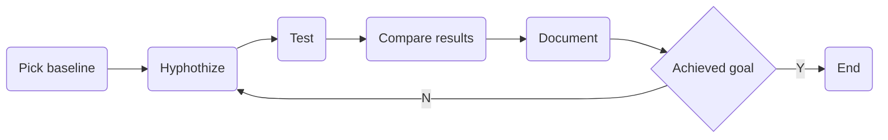
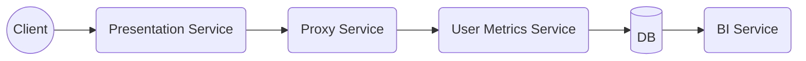

This article is a recap of [my presentation at Devoxx Ukraine 2021](https://www.youtube.com/watch?v=pPu1w4Zlhoc) about resolving performance issues.

# Agenda

We have a lot to discuss.
1. Most important — motivation — why should we even spend time on this talk? What problem do we solve? Why do we care about this?
2. We also should get onto the common ground in terms of terminology. I will specify what I call systems performance study and will ruin some common myths.
3. It is essential to mention what methodologies(or patterns) people usually use when they encounter performance issues in production and why they are ineffective and often lead to erroneous results. If we want to know how to do something right, it is good to know what not to do.
4. After that, we will discuss a methodology that I recommend following to locate and fix performance issues with a real-life example.

# Motivation

{: width="1000" height="400" }

I have worked with multiple teams, domains, and companies, and most of the time, I have seen people making the same mistakes when encountering performance issues. When trying to achieve goal X, they chaotically move from one hypothesis to another, blaming 3rd party, blaming another team, etc. And after a lot of struggling with googling, asking questions on stack overflow, and random tuning of JVM parameters(or any other hyperparameters of the system), they create some new problems, believe that they resolved the issue, or try to convince their manager that problem is fundamental and unsolvable. That is ineffective and **not the path of an engineer**.

When developing a system, we think of functional and non-functional requirements, create architecture, and plan our work. We are working by *methodology* — an ordered list of steps that we should do to complete the task.

I ask myself why resolving performance issues should differ fundamentally? We definitely should cultivate methodology, guidelines, and engineering culture of resolving performance issues to fix stuff effectively, consistently, and estimate our work, like any other activity of a software engineer.

# Definitions

## Systems Performance

So, system performance measures how well the system performs under applied load. *Performance* can be measured by observing the states of system components, both software, and hardware.

*Performance engineering* is a set of techniques used to ensure the required level of system performance described as a non-functional requirement for system architecture.
Performance engineers' typical activities are setting up observation and monitoring system components, profiling system components against specific or significant workloads to find bottlenecks,  hypothesizing about performance issues root causes, validating theories, and fixing bottlenecks.
Most of the time, it involves deep-dive through the system stack from application down to the hardware, so it is crucial to understand your **underlying stack** and what **tools** can be applied to each system component to fix issues effectively.

## Latency VS Response Time

Some of the metrics are the object of misinterpretation, and I want to talk about it, because this is essential in the article context.
**The most common** misinterpretation is latency vs. response time.

*Latency* is a connection latency — the time that the server needs to receive a data package. We are most interested in the time spent on sending, processing, and receiving data — *response time*, because it is a crucial metric for this methodology.

## Utilization VS Saturation

The next pair of related terms are utilization and saturation.

*Utilization* — a measurement of how busy some resource was.

*Saturation* — a measurement of work queued, i.e., can not be processed right now, and awaits resource.

For example — your CPU has more work than it can process simultaneously, so it queue work to process later. So CPU became saturated.

> Good sidenote: if none of your resources are saturated, probably your performance is acceptable.

# Performance is tough topic

## Subjectivity

The first and foremost problem is the topic of subjectivity. How do we know if we even have a problem?

For example, if I believe our web service has to respond in 100ms or less for 99th percentile of requests to ensure good performance. And my colleague believes that we have to react in 200ms or less. Who is right and why?

Setting up performance goals is challenging and not intuitive.

The second problem is caused by first - do we know where to stop? If we optimized bottleneck and reduced response time by 20%, is it enough to stop, or should we continue our work?

## Investigation

Investigating issues is challenging, because it is often unclear where we must begin searching for the problem.
Usually, we only know that we may have a problem somewhere in our system, but nothing specifically.
It is hard to understand what components and metrics we can ignore during the investigation and where we should look first and spend more of our time.
But this is crucial for estimating time before the fix and spending our time most effectively.

## Mental Complexity

The most critical complexity issues are cognitive biases.

Cognitive biases are often a result of our brain attempting to simplify information processing. Cognitive bias tends to think a certain way, often deviating from rational and logical decision-making.
We are consistently getting bombarded with information. Biases help us unclutter the data and reach decisions with relative speed. However, biases can subtly creep in and influence our choices.
As human beings, we like to think we are rational - but in reality, we are prone to biases that cause us to think and act irrationally. To some extent, every one of us will have exhibited a bias blind spot in our lifetime.
Also, we are less likely to detect bias in ourselves than others.

Researchers from Carnegie Mellon University, the City University London, Boston University, and the University of Colorado [studied this hypothesis](https://pubsonline.informs.org/doi/pdf/10.1287/mnsc.2014.2096).
Based on this study Buster Benson developed Cognitive Bias Codex[^fn-1] with more than 200 cognitive biases (lists keep growing) can impact our rational thinking.
Wow, 200+ biases. That's a lot to handle.

Performance engineer has to be objective, and our goal is to avoid biases at any cost.

The next factor is cognitive complexity itself. As *Miller Law states*[^fn-2], the number of objects an average human can hold in short-term memory is 7 ± 2. We often have to operate in very complex environments and analyze thousands of metrics at hundreds of components at multiple machines in geographically separated data centers; during performance analysis, as Miller Law states, we should understand how to tackle this complexity and not burn our minds.

Finally, sometimes we can even have multiple issues arise in our system simultaneously, or we can have one problem induced by various causes.

# Antipatterns

This section is about mistakes people make when they try to resolve performance issues by themself without putting much thinking and planning into this activity and consequences that haunt them afterward.

## Early Blaming

Early blaming is a trendy pattern of action. When something terrible happens, people tend to move responsibility to others without confirming it, because they avoid solving a problem itself, or do not believe they can have a problem.

People often blame other services, such as third parties or a neighboring team whose service interacts with ours, responsible for performance drop because historical data shows this trend. For example, if this adjacent team dropped the whole system's performance last month, on the following incident, everybody will think that they again did something wrong.

Another example is blaming system components that are often underperforming, such as Databases, Messaging systems, or JVM. In my practice blaming the Database is the most common pattern. People think that all their problems come from slow MySQL or OracleDB without verifying this hypothesis.
The same goes for frameworks or libraries. Most of the time in the Java world, it is about Spring or Hibernate.

Remember, early blaming leads you to biased, subjective, and ineffective investigation in a falsely narrowed scope.

## Streelight search

The streetlight effect, or the drunkard's search principle, is an observational bias that occurs when people only search for something that is easiest to look at. Both names refer to a well-known joke.

> A policeman sees a drunk man searching for something under a streetlight and asks what the drunk has lost. He says he lost his keys, and they both look under the streetlight together. After a few minutes, the policeman asks if he is sure he lost them here, and the drunk replies, no, and that he failed them in the park. The policeman asks why he is searching here, and the drunk answers, "this is where the light is."

Applying this anti-method or antipattern to our topic means that people only use tools and utilities they know and look only at system components and metrics they know.
**People fix only problems they know how to fix.**
There is an obvious drawback to this strategy — imagine how easy it is to miss a lot of performance issues, probably the ones that contribute to performance degradation at most.

Remember, performance engineer has to be aware of all system components and as many types of performance issues as possible. But more important is that you should memorize that there always will be things that you don't know, and you should look for them.

## Folklore Tuning

Folklore tuning is my favorite antipattern, and I assume it is the most common one.

Have you ever heard how your colleague said to you: "Hey, recently I saw a conference talk of Aleksey Shipilëv[^fn-3], where he showed some great configurations for JVM, let's tune them on our project!"? This was the case at all companies I have worked for. People always look on the internet for answers, where people with an unknown level of expertise and interest share their thought and write guides. And most of the time, it does not end well for your project.

Please, remember — each system has a unique tech stack, business processes, workloads, team members, and goals.
Magic configs from stack overflow may not help you improve your performance but can degrade or even cripple your production in runtime. I've been there, consequences of applying this pattern can be disastrous.

# Methodology

Okay, so we discussed what performance is, why it is complex, what you should definitely omit when trying to improve performance, and now it is time I present you a concise way of thinking, a working reasoning model, and a set of guidelines that helped me survive through multiple performance disasters.

So in this chapter, I will try to answer the question: "How to approach resolving performance issues?".
But once again, I encourage you to analyze everything I tell you and challenge all these without blind acknowledgment!

## Key Questions

I present vital steps that you have to complete to fix the performance issue. They are general and project or tech agnostic.
1. Do we have a problem? Indeed, it is crucial to understand and clarify with the help of non-functional requirements to your project if a newly arrived issue is a problem that has to be solved.
2. If we conclude that we indeed have a problem that one should resolve, we should set up a Definition of Done or acceptance criteria. That would be our stop point, after which we should not spend our time on this task.
3. So we set up our acceptance criteria, and now we have to locate causes. Issues location is one of the obscurest places in methodology, and we will look at its specifics.
4. Finally, when we located all root causes, we had to prioritize the issue, estimate possible revenue from resolving it, and prepare for fixing it. Fixing itself can vary dramatically from problem to problem. Therefore I omit this point in the article.

Now let's handle each question separately and in detail.

## Problem Statement

Most of the time, you will know about performance issues from a third party, like support. When they come to you asking what is happening with your system, you should know what information you need, in order to filter only requests that matter to save some time to drink beer with your teammates.

So our questions are:
1. Why do you think we have a performance issue? This question filters requests that may not be performance-related and provide you information about the visible effects of the problem, i.e., how users perceive this issue.
2. Recent changes in software, hardware, or applied load? This question can immediately lead you to the reason for performance degradation. Also, it can help you with a short-term fix plan - revert recent changes.
3. Can the issuer express the problem in terms of metrics? If a person who reports performance issues can not refer to any metrics and say performance degradation in words of RPS, latency, FPS, or any other metric, that may mean you have no issues at all or that your observation mechanisms need additional work. Otherwise, you will have concrete advice to acceptance criteria - for example, return latency and RPS to the previous level.
4. How critical is this problem? Production is down, users are complaining, etc. Answer to this question will help to prioritize your work. If your system is down, it is probably your #1 task in the backlog now. Or if some statistics service that no one cares about is underperforming, you may not even need to spend time on it. There is always something that can bring more value.
5. Understand where we have problems - staging, preproduction, production, what systems are under load, etc. Ask about system configuration and environment details. The more info you have, the better.

These questions may vary from company to company or even team to team, but this template has served me well a long time as the base questionnaire.

## Local Stop Point

So, we confirmed that we indeed have a problem, and we need to solve it. Now it is time for us to set up expectations and stop-points of tuning.
Where do we stop spending time on an issue?

Well, this business-driven question - you stop when there is no value in continually improving performance.
If you have not developed any business criteria or are unclear, we can move with this list.

1. "Performance is back on the previous level" is the perfect option, but sometimes it is too expensive, especially if recent software changes with new features introduce performance degradation and business are not ready to withdraw this fancy feature.
2. It is okay to stop when you have found a significant bottleneck and restored something like 70% of previous performance. Although this solution is not perfect in terms of performance, it is often an acceptable option from a business perspective.
3. If you understand that further investigation costs more than potential performance gains, it is time to stop. If you spend three months tuning an application that brings 200$ per month, you are probably burning the company's money, and your time costs much more.
4. If you have found a significant bottleneck that can bring more value than the current issue, you should probably take a break from this issue and reprioritize your work.

These are common stop-points, but the general advice is - do things that bring more value. You are doing this to make more money, not for your fun.

## Locating root cause

Now it is time for us to develop a unified strategy for locating the root causes of issues.
We will look at the multi-service system as a most complex system from a hierarchical perspective. Keep in mind that you can also apply a methodology to monolith solutions.

1. Identify failing services using the RED method and observation tools alerts. Don't be afraid. I will explain the RED method later. First of all, we have to narrow the scope of the search area. We will look at unhealthy services and mark them for further investigation.
2. When we locate unhealthy(aka failing services), we will have to find failing components(or resources) at that services using the USE method(which I will also explain later).
3. After locating all failing components, we drill through them with tracers or profilers to find the root cause.

If we look through all failing services and all failing components, we will find all root causes, and after that, we can quantify how much each cause contributed to issue or issues performance degradation and plan to fix them.

## RED Method

RED is an acronym for Request Rate, Errors, and Durations. It is enough to monitor these three types of metrics to judge if the service is healthy. You have to compare the values of these metrics to historical data of baseline when everything was fine and find a discrepancy. If you have found that the request rate has dropped, or the number of errors has grown, our response time has increased, something terrible is happening to the service, and it is unhealthy.
It is good to look at metrics that observe interaction with other services to ensure that the current service is not failing because of another service called cascade failures and is hard to investigate.

## USE Method

USE method is an analog of the RED method for the concrete computer system. USE is also an acronym for Utilization, Saturation, Errors. To find one failing, you must check each resource's utilization, saturation, and errors (or system component).
Let's go step by step:

1. Identify all resources on the system - CPU, memory, file system, network devices, applications, etc.
2. Pick them one by one, and check their metrics.
3. If you have found some anomalies - proceed with profiling and tracers deep down into components.

Otherwise, keep looking at other resources.

## Tracing and profiling

At this point, it becomes fascinating and varying. Depending on what RED and USE method resulted for you, you may need to use different tools.

1. If you have found that some applications are causing troubles - go with on-CPU/off-CPU analysis, thread and locks analysis, application memory analysis. For JVM projects, you can use Java Mission Control, Java Flight Recorder, VisualVM for observation.
2. If you have found that system resources are responsible for your issues, you may go with BPF utils or default Linux stat and tracing utilities.

From here, only your experience and knowledge can help you.

## Experimenting

Here is the general experimenting flow. You have found the root cause, and now you are applying some fixes. How can you justify your changes? What is the mechanism of experimentation?

1. First of all, pick a baseline - document your initial metrics results.
2. Hypothesize a solution and test it with the help of a benchmark.
3. Compare your results with a baseline. Document your results.
4. Repeat until you meet your acceptance criteria. If you have completed your acceptance criteria, then you have to stop.

Important sidenotes:
Do only one change per cycle. Do not twist two knobs at once. If you start mixing different shifts, you will not know what difference helped or was disastrous.

# Example

We looked at the methodology and now let's try how this methodology performs at real-life example step by step.

## Environment Overview

Let's set up our experiment environment. We have a system with four services and one Database.

Our system is a service with presentations when customers can view presentations.
We will only look at part of the system responsible for accounting views for business intelligence needs.

We have a presentation service, which clients use for interaction with our system. This presentation service accepts requests from clients when they open a presentation. Presentation service, among other things, has to notify user metrics service via proxy service.

Proxy service is just a mediator added for clarity of example.

User metrics service is responsible for consuming metrics from other services and storing them into some database.

And there is also some business intelligence service that analyzes data from the Database using some scheduled jobs.

It is a terrible architecture solution, but it is both simple and powerful enough to serve as an excellent example for methodology.

## Emergency

So you are the software engineer responsible for that system, and someday when you plan to chill out, read some tech blogs, solve a few tickets from your JIRA, a Second Level Support Engineer call you and tell you that clients are experiencing lags, company receives a lot of complaints, and we start to lose money.
What should you do to stop this mess?

Options:
1. Panic?! Sound reasonable, but ineffective. An engineer has to be a cold-blooded creature with a lizard brain. Stop the panic and reason. (This is good advice for entry-level engineers in general - calm down and think if you have a problem). Let's move on.
2. Call your team leader? It's probably a good idea if you can't handle it yourself, but if you are a tech specialist on duty responsible for the system, you have to solve it by yourself first.
3. Rush checking logs on presentation service? It is better than previous options but still may be ineffective—most of the time, log records aren't helping with investigating performance issues.
4. But wait, we have some methodology explicitly designed for this problem. Let's try to solve this issue going step by step.

So we start using the methodology. We will go step-by-step, and I will make small conclusions after each step so that we can track our progress as we move through.
So our first step is the problem statement.

## Problem statement

So we calmed down a Second Level Support engineer and started asking questions.
1. Question: Why do you think we have a performance issue? Answer: We have complaints from our customers about long presentation loading. Okay, not much info, but now we know that there is a problem, it has user impact, and it is critical as the ability of customers to view presentations is a core functionality of the system, so the company is losing money or will start to lose them soon.
2. Question: Do we have some recent software, hardware, or load changes? Answer: There was no hardware or load changes. I do not know about software. Okay, not much luck. We will have to look everywhere. But I recommend a zero-trust approach. If the SLS engineer tells us there were no changes, it does not mean there were no changes. It means that they may or may not change that SLS is unaware of. So keep your eyes open, as nothing can be ruled out.
3. Question: Can we express a problem in terms of metrics? Answer: Our Grafana shows that response time on client raised from 100 milliseconds to 3 seconds in the 99th percentile. Okay, so now we have a baseline for a client, it will be helpful to set up our acceptance criteria.

## Problem statement conclusions

Let us make the first conclusions after the problem statement.
So:
1. We indeed have a problem with loading presentations.
2. We do not know if there were any software updates, and we should keep this info in mind.
3. The load has not changed, but response time raised. That implies that probably something had changed on our side and degraded performance. Either software, hardware, or configuration has changed. So this is not a load issue.

For simplicity, let's set activity acceptance criteria as "Response time for the client should return to the previous level."

## RED Method

So we know that we indeed have a problem, and we set our acceptance criteria. Let us move to the next step in methodology - let's check all our services with the RED method. Order of check may vary, but I recommend following the data path from the issue reported location down to the data root. Most of the time, it is the fastest way.

So we check the Presentation service.
We observe an increased amount of errors, a low level of requests per second, and response time majorly increased on requests to proxy service.
So it looks that the Presentation Service was failing because of the slow proxy service. These cascading issues are common in microservice architecture when people forget about the Circuit Breaker pattern.

The following service is the proxy.

### Proxy Service

The process here is the same. I deliberately copy-pasted the previous Slide to show the repetitive manner of checking services. Sometimes performance engineering is boring.
Once again, we see some issues on the next service in the data-path - user metrics service. We should check it out.

### User Metrics Service

So we finally reached user metrics service.
Looking at RED metrics on DB, we see the following:
1. The number of errors on DB writes majorly increased compared to historical data
2. Amount of transactions per second lowered significantly
3. And database response time also raised

Conclusions - DB is a terminal service in our data-path
All other services were failing because of it. We need to examine the system components of the DB service and find out what happened to it.

## USE Method

Okay, we should examine the Database with the USE Method.
First of all, we have to identify resources on the target system.
We have the DB application, network, disk, memory, file system, and CPU.
Let's iterate through the list of resources. Once again, the order is not fixed; you can choose any ranking you like, but I prefer going from top components in user-space to kernel space and hardware because most issues arise at user-space applications.
Picking up the Database application itself, we see that DB has no errors, average utilization is 90%, and DB is saturated - we have 4000 requests in a queue.
Moment of reflection. Wait, why is utilization 90% and the system is saturated? I said 20 minutes ago that saturation arises when we fully utilize the resource. That is sneaky tooling that can fool you here. It is common to visualize utilization over some period instead of instant utilization. For example, if parking near your office is filled in the morning, parking utilization is 100%. And your parking has a lot of free lots at midnight with the utilization of 5%; then when we say that average utilization is 60% per day, how much does this give to you about load spikes in the morning? Not much. So beware of this. Many engineers fall into this trap. If you see that utilization is less than 100%, that does not mean you do not have any saturation.

## DB Analysis conclusions

Okay, so now we know that the failing component is Database, and it is saturated. It does not have any errors. Remember that SLS told us that load from the client has not changed over time and corresponds to historical data.
It is easy to fall into cognitive bias and believe DB has bugs and performance degradation "just happened" without reason.

But let us reason about our findings:
Does DB have any other clients? Yep, it is the Bussiness Intelligence service. If we do not find anything useful at the BI service, we will return to the Database and examine other system components.

## BI Service

So we check BI service metrics. Everything looks fine, and we have no errors.
But when we compare metrics with historical data, we can see that service had periodic pikes of load at 3 AM, out of business hours, but today spike is at 3 PM, just around the time SLS guy has called us.

As we know, the BI service schedules jobs to grad data from DB and process it. Probably somebody changed the scheduler configuration and messed with job time.

Checking configuration proofs that, and now we know that somebody has changed scheduler job execution time to 3 PM, right at the peak of business hours at presentation service.

## Fixing issue

We were sure that this configuration change at BI service caused additional load on DB service, and online transaction processing was endangered by online analytical requests processing.
Pretty obvious hypothesis fix - stop this job and revert destructive configuration changes, which should reduce the load on DB and decrease the response time for clients to the baseline.
We apply according to changes and monitor our services.
We can see that metrics are back to typical values. We met our acceptance criteria and can close the ticket, respond to SLS with our investigation details, and deploy a fix.
The final important step - document your findings and report to your team leader or manager. Every production incident, including performance degradation, must be discussed, and your team should develop reasonable prevention actions.

This is it, and you earned your coffee. Together we resolved the performance issue, and it is time for us to recap the highlight of this talk.

# Conclusions

I have mentioned a lot of technical topics, but we have not concentrated our attention on them because this talk is not about technologies themselves. It is about growing an engineer in yourself. It is about developing structural and rational thinking. It is about abandoning your emotions and keeping your head cold. It is about bringing value to everything you do. It is about mindset. It is about how you perceive the world around you and yourself in this world.
First of all, if you are an engineer, you have to develop business-oriented thinking. By saying this, I mean constantly reviewing your actions and asking yourself. My current activity helps grow the project or the company I work for? If the answer is no, you should abandon this activity and find something useful to do.
The getting Things Done principle is fantastic, but it means nothing if you do dumb tasks that do not help your business. That is business thinking I encourage you to cultivate in yourself.

Your time is your most valuable asset, and you have to spend it wisely. There is a popular expression:
An engineer has to be lazy.
Do not do things you do not need to do.
Do the most important things first. Maybe other tasks will die by themselves.
Do things as simple as possible, but not simpler.
Plan your work, constantly optimize all of your activities. This methodology is a product of time-management principles. When you need to complete something quick, you need a good plan and an attitude to keep to that plan.

Performance engineering can bring a lot of fun, but the hard truth is that you should do it only when you need to because it is challenging and time-consuming to make right. If you are not a dedicated performance engineer, you probably have better things to do with your work, but you need to know what to do when a problem arises and crush it like a rockstar.

Use a systematic or even scientific approach - plan your activities, research unknowns, and transform them into unknowns. Document your findings, document your systems, and make your reasoning and actions clear and understandable for all - engineer a sustainable world. Follow the darkness and encourage knowledge expansion.

[^fn-1]: Buster Benson [cognitive biases list](https://busterbenson.com/piles/cognitive-biases/) on his personal web-site.
[^fn-2]: George A. Miller (1956) Harvard University — [The Magical Number Seven, Plus or Minus Two: Some Limits on our Capacity for Processing Information](http://psychclassics.yorku.ca/Miller/)
[^fn-3]: Aleksey Shipilëv — Java performance engineer. Has a great [technical blog](https://shipilev.net/)
