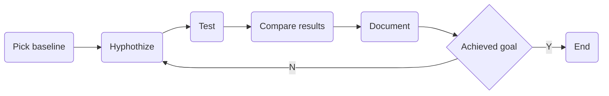
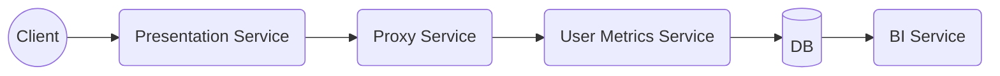

This article is a recap of my presentation at Devoxx Ukraine 2021 about resolving performance issues.



# Motivation

Based on my extensive experience, I've noticed that many people make the same mistakes when tackling software performance issues. During investigations, they chaotically bounce between different hypotheses, blame others, etc. After extended googling, scrolling Stack Overflow, and random tuning hyperparameters of the system, they usually create new problems.

{: width="1000" height="400" }

We think of functional and non-functional requirements during development, create architecture, and plan our work. We are working by methodology  -  an ordered list of steps that we should do to complete the task. Why should resolving performance issues differ fundamentally? We should cultivate methodology, guidelines, and engineering culture for resolving performance issues. That will allow us to fix stuff effectively, predictably, and consistently.

# Definitions

## System Performance and Performance Engineering

System performance measures how well the system performs under applied load. Performance can be measured by observing the states of system components, both software and hardware.

Performance engineering is a set of techniques to ensure the required level of system performance is reached. Commonly, the necessary level of performance is described as a non-functional requirement for system architecture.

Performance engineers' typical activities:
- setting up observation and monitoring system components;
- profiling system components against specific or significant workloads to find bottlenecks;
- hypothesizing about performance issues' root causes;
- validating theories;
- fixing bottlenecks.

Most of the time, it involves deep-dive through the system stack from the application to the hardware. So is crucial to understand your underlying stack and what tools can be applied to each system component to fix issues effectively.

## Latency and Response Time

Some metrics are the object of misinterpretation, and I want to talk about it because this is essential in the article context. The most common misunderstanding is the difference between latency and response time.

Latency - connection latency,  the time the server needs to receive a data package.

Response time - a time spent on sending, processing, and receiving data.

Understanding the difference between them is crucial in terms of that methodology.

## Utilization and Saturation

The next pair of related terms are utilization and saturation.

Utilization - a measure of how busy some resource was.

Saturation - a measure of work queued, i.e., can not be processed right now, and awaits resources.

For example - your CPU has more work than it can process simultaneously, so it queues work to process later. So the CPU became saturated.

> Good sidenote: if none of your resources are saturated, probably your performance is acceptable.

# Performance Complexity

## Subjectivity

The first and foremost problem is the topic of subjectivity. How do we know if we even have a problem?

For example, our web service must respond in 200ms or less for the 99th percentile of requests to ensure good performance. And my colleague believes that we have to react in 100ms or less. Who is right and why?

Setting up performance goals is challenging and not intuitive.

The second problem is caused by the first - do we know where to stop? If we optimized bottleneck and reduced response time by 20%, is it enough to stop, or should we continue our work?
## Investigation

Investigating issues is challenging because it is often unclear where to begin searching for the problem. Usually, we only know that we may have a problem somewhere in our system, but nothing specifically. It is hard to understand what components and metrics we can ignore during the investigation and where to look first and spend more time.

## Mental Complexity

The most critical complexity issues are cognitive biases.

Cognitive biases are often a result of our brain attempting to simplify information processing. We are consistently getting bombarded with information. Biases help us unclutter the data and make decisions faster. However, biases can subtly influence our choices. Cognitive bias tends to think a certain way, often deviating from rational and logical decision-making. To some extent, we will have exhibited a biased blind spot in our lifetime. Also, we are less likely to detect bias in ourselves than others.

Researchers from Carnegie Mellon University, the City University London, Boston University, and the University of Colorado [studied this hypothesis](https://pubsonline.informs.org/doi/pdf/10.1287/mnsc.2014.2096). Based on this study Buster Benson developed Cognitive Bias Codex[^fn-1] with more than 200 cognitive biasescan impact our rational thinking. That's a lot to handle, and the list is growing.

Performance engineering has to be objective, and we aim to avoid biases at any cost.

The next factor is cognitive complexity itself. As *Miller Law states*[^fn-2], the number of objects an average human can hold in short-term memory is 7 ± 2. We often have to operate in very complex environments and analyze thousands of metrics at hundreds of components at multiple machines in geographically separated data centers; during performance analysis, as Miller Law states, we should understand how to tackle this complexity and not burn our minds.

Finally, sometimes we can even have multiple issues arise in our system simultaneously, or we can have one problem induced by various causes.

# Antipatterns

This section is about mistakes people make during resolving performance issues without a concrete plan. And about the consequences that haunt them afterward.
## Early Blaming

Early blaming is a trendy pattern of action. People tend to shift responsibility to others unfounded when something terrible happens. They avoid solving a problem or do not believe they can have a problem.

People often blame other services for performance drops because previous experience may show such a trend. For example, if this adjacent team dropped the whole system's performance last month, on the following incident, everybody will think that they again did something wrong.

Another example is blaming system components that often underperform, such as Databases, Messaging systems, or JVM. In my practice blaming the Database is the most common pattern. People think all their problems come from slow MySQL or OracleDB without verifying this hypothesis. The same goes for frameworks or libraries. Most of the time, it is about Spring or Hibernate in Java.

Remember, early blaming leads to biased, subjective, ineffective investigation in a falsely narrowed scope.

## Streelight search

The streetlight effect, or the drunkard's search principle, is an observational bias that means searching only for something that is easiest to look at. Both names refer to a well-known joke.
> A policeman sees a drunk man searching for something under a streetlight and asks what the drunk has lost. He says he lost his keys, and they both look under the streetlight together. After a few minutes, the policeman asks if he is sure he lost them here. The drunk replies: "No, I have lost them in the park." The policeman asks why he is searching here, and the drunk answers: "This is where the light is."

In our case, people only use tools and look exclusively at system components and metrics they know. People fix just problems they know how to fix. There is an evident drawback - it is easy to miss a lot of performance issues, probably the ones that contribute to performance degradation the most.

Performance engineers must know all system components and as many performance issues as possible. But more important is that there will always be things you don't know and you should look for them.
## Folklore Tuning

Folklore tuning is my favorite antipattern and the most common one.

Have you ever heard how your colleague said to you: "Hey, recently I saw a conference talk of Aleksey Shipilëv[^fn-3], where he showed some great configurations for JVM, let's tune them on our project!"? People always look for answers online, where people with unknown expertise and interest share their thoughts and write guides. And most of the time, it does not end well for your project. This was the case at all companies I have worked for.

 that  each system has a unique tech stack and environment. Magic configs from Stack Overflow may not help you improve your performance but can degrade or even cripple your production in runtime. I've been there. The consequences of applying this pattern can be disastrous.

# Methodology

It is time to present a set of guidelines that helped me survive multiple performance disasters.
> I encourage you to analyze everything I tell you and challenge all these without blind acknowledgment!

## Problem Statement

Most of the time, you will know about performance issues from a third party, like support. When they come to you asking what is happening with your system, you should know what information you need. That way, you can filter only requests that matter to save some time to drink beer with your teammates.

So our questions are:
1. _Why do you think we have a performance issue?_ \
This question filters requests that may not be performance-related and provide you with information about the visible effects of the problem, i.e., how users perceive this issue.
2. _Recent changes in software, hardware, or applied load?_ \
This question can immediately lead you to the reason for performance degradation. Also, it can help you with a short-term fix plan - revert recent changes.
3. _Can the issuer express the problem in terms of metrics?_ \
Suppose a person who reports performance issues can not refer to any metrics and say performance degradation in words of RPS, latency, FPS, or any other metric. That may mean you have no issues or your observation mechanisms need additional work. Otherwise, you will have concrete advice to acceptance criteria  -  for example, return latency and RPS to the previous level.
4. _How critical is this problem?_ \
An answer to this question will help to prioritize your work. If your system is down, it is probably your #1 task in the backlog now.
If some obscure statistical service does not meet expectations, it might not be worth the sweat. There is always something that can bring more value.
5. _Can you identify where we're facing issues - staging, preproduction, production, or understanding which systems are under strain?_ \
Ask about system configuration and environment details. The more info you have, the better.

These questions may vary from company to company or even team to team. But this template has served me well as the base questionnaire.

## Local Stop Point

So, we confirmed that we have a problem and must solve it. Now it is time for us to set up expectations and stop-points of tuning. Where do we stop spending time on an issue?

Well, when to stop is primarily dictated by business needs  -  you halt once the continuous performance improvement no longer adds value. We can proceed with this list if your business objectives are unclear or not yet defined.

List of common stop-points:

1. Restoring performance to its previous level can be costly. Sometimes, new software updates can cause a drop in performance, but companies are reluctant to remove the added features.
2. It is okay to stop when you have found a significant bottleneck and restored something like 70% of the previous performance. Although this solution could be better in terms of performance, it is often an acceptable option from a business perspective.
3. You have to stop if you understand that further investigation costs more than potential performance gains. If you spend three months tuning an application that brings $ 200 per month, you are likely burning the company's money because your time costs much more.
4. If you spot a more valuable bottleneck than the current issue, pause and rearrange your priorities.

Despite these common points, it's best to prioritize actions that offer more value. You are doing this to make more money, not for your fun.

## Locating root cause

Now it is time for us to develop a unified strategy for locating the root causes of issues. We will look at the multi-service system as a most complex system from a hierarchical perspective. Keep in mind that you can also apply a methodology to monolith solutions.

Let us follow the steps:

1. _Identify failing services_ using the RED method and observation tools alerts. Don't be afraid. I will explain the RED method later. First of all, we have to narrow the scope of the search area. We will look at unhealthy services and mark them for further investigation.
2. When we find unhealthy services, we need to _pinpoint the failing parts_. We do this using the USE method, which I'll explain later.
3. After locating all failing components, we _drill through them_ with tracers or profilers to find the root cause.

By examining all malfunctioning services and components, we'll uncover the root causes. We can then measure how each cause has affected performance and develop a plan to address them.
## RED Method

RED is an acronym for Request Rate, Errors, and Durations. It is enough to monitor these three types of metrics to assert service health by comparing them to the healthy baseline. The service is unhealthy if there's a drop in request rate, a rise in errors, or slower response times. It's beneficial to examine metrics related to interactions with other services. This can help verify if the present service's issues are due to cascade failures from another service. However, that can be challenging to investigate.
## USE Method

USE is also an acronym for Utilization, Saturation, and Errors. It is analogous to the RED method for the concrete computer system. You must check each resource/component metric to find the faulty one.

To do that, you have to:

1. Identify all resources on the system  -  CPU, memory, file system, network devices, applications, etc.
2. Pick them one by one, and check their metrics.
3. Should you discover any anomalies  -  proceed with profiling and tracers deep down into components.

Otherwise, keep looking at other resources.

## Tracing and profiling

At this point, it becomes fascinating and varying. Depending on what RED and USE method resulted for you, you may need to use different tools.

1. If you have found that some applications are causing troubles - go with on-CPU/off-CPU analysis, thread and locks analysis, application memory analysis. For JVM projects, you can use Java Mission Control, Java Flight Recorder, VisualVM for observation.
2. If you have found that system resources are responsible for your issues, you may go with BPF utils or default Linux stat and tracing utilities.

From here, only your experience and knowledge can help you.

## Experimenting

Here is the general experimenting flow. You have found the root cause, and now you are applying some fixes. How can you justify your changes? What is the mechanism of experimentation?

1. First of all, pick a baseline - document your initial metrics results.
2. Hypothesize a solution and test it with the help of a benchmark.
3. Compare your results with a baseline. Document your results.
4. Repeat until you meet your acceptance criteria. If you have completed your acceptance criteria, then you have to stop.

> Important sidenote:
> Do only one change per cycle. Do not twist two knobs at once. If you start mixing different shifts, you will not know what difference helped or was disastrous.

# Example

We looked at the methodology, and now let's see how this methodology performs a real-life example step by step.

## Environment Overview

Let's set up our experiment environment. We have a system with four services and one Database, as shown in Figure.

Our system is a service that allows customers to view presentations. We will only look at part of the system responsible for accounting views for business intelligence needs.

We have a presentation service, which clients use for interaction with our system. It accepts requests from clients when they open a presentation. Service, among other things, must notify user metrics via proxy.

We have a presentation service, which clients use for interaction with our system. This presentation service accepts requests from clients when they open a presentation. Presentation service, among other things, has to notify user metrics service via proxy service.

Proxy service is just a mediator added for clarity of example.

The user metrics service is responsible for consuming metrics from other services and storing them in the Database.

And business intelligence service also analyzes data from the Database using scheduled jobs.

It is a terrible architecture solution, but it is simple and powerful enough to serve as an excellent methodology example.

## Emergency

Imagine you are the software engineer responsible for that system. One day, when you plan to chill out, read some tech blogs, and solve a few tickets from your JIRA, a Second Level Support Engineer tells you that clients are complaining about lags. And the company is losing money. What should you do to stop this mess?

Options:
1. Panic?! Sound reasonable but ineffective. An engineer has to be a cold-blooded creature with a lizard brain. Stop the panic and reason.
2. Call your team leader? It's a good idea if you can't handle it yourself, but you must try to solve it first if you are a tech specialist on duty.
3. Rush checking logs on presentation service? It is better than previous options but still may be ineffective most of the time. Log records aren't helping investigate performance issues.
4. But wait, we have some methodology explicitly designed for this problem. Let's solve this issue step by step.

> Good advice for entry-level engineers  -  calm down and think if you have a problem.

## Problem statement

We will follow methodology, and I will make small conclusions after each step to track our progress. First, we shall state the problem.

So we calmed down a Second Level Support engineer and started asking questions:

1. _Question_: Why do you think we have a performance issue? \
_Answer_: We have complaints from our customers about long presentation loading. \
_Analysis_: That's not much, but at least we know that there is a problem, it has a user impact, and it is critical. The ability of customers to view presentations is a core functionality of the system, so the company is losing money or will start to lose them soon. \
2. _Question_: Do we have recent software, hardware, or load changes? Answer: There were no hardware or load changes. I do not know about software.\
_Analysis_: We are unlucky and will have to look everywhere. But I recommend a zero-trust approach. If the SLS engineer tells us there were no changes, it does not mean there were no changes. It means that they may or may not change that SLS is unaware of. So keep your eyes open, as nothing can be ruled out. \
3. _Question_: Can we express a problem in terms of metrics? \
_Answer_: Our Grafana shows that response time on clients raised from 100 milliseconds to 3 seconds in the 99th percentile. \
_Analysis_: We have a baseline for a client, and it will be helpful to set up our acceptance criteria.

Let us summarize.

The latency of presentation loading has increased. The load has not changed, which implies that something has changed on our side and degraded performance. Either software, hardware, or configuration has changed. So this is not a load issue.

Let's set activity acceptance criteria for simplicity: "Response time for the client should return to the previous level."

## RED Method

Let's move to the next step in methodology  -  check all our services with the RED method. The check order may vary, but I recommend following the data path from the issue-reported location to the data root. Most of the time, it is the fastest way.

Check the Presentation service. We observe an increased amount of errors, a low level of requests per second, and a response time majorly increased on requests to proxy service. So the Presentation Service failed because of the slow proxy service. These cascading issues are common in microservice architecture when people forget the Circuit Breaker pattern.

### Proxy Service

The following service is the proxy. The process here is the same. Sometimes performance engineering is boring. Once again, we see issues with the following service in the data path  -  user metrics service. We should check it out.

### User Metrics Service

So we finally reached user metrics service. Looking at RED metrics on DB, we see the following:

1. The number of errors on DB writes majorly increased compared to historical data.
2. The number of transactions per second lowered significantly.
3. Database response time was also raised.

_Conclusion_: DB is a terminal service in our data path. All other services were failing because of it. We need to examine the system components of the DB service and find out what happened to it.
## USE Method

Okay, we should examine the Database with the USE Method.
First of all, we have to identify resources on the target system.
We have the DB application, network, disk, memory, file system, and CPU.
Let's iterate through the list of resources. Once again, the order is not fixed; you can choose any ranking you like, but I prefer going from top components in user-space to kernel space and hardware because most issues arise at user-space applications.
Picking up the Database application itself, we see that DB has no errors, average utilization is 90%, and DB is saturated - we have 4000 requests in a queue.
Moment of reflection. Wait, why is utilization 90% and the system is saturated? I said 20 minutes ago that saturation arises when we fully utilize the resource. That is sneaky tooling that can fool you here. It is common to visualize utilization over some period instead of instant utilization. For example, if parking near your office is filled in the morning, parking utilization is 100%. And your parking has a lot of free lots at midnight with the utilization of 5%; then when we say that average utilization is 60% per day, how much does this give to you about load spikes in the morning? Not much. So beware of this. Many engineers fall into this trap. If you see that utilization is less than 100%, that does not mean you do not have any saturation.

## DB Analysis conclusions

We should examine the Database with the USE Method. First, we must identify resources on the target system: DB application, network, disk, memory, file system, and CPU. Let's iterate through the list of resources.

> Once again, the order is not fixed. You can choose any ranking you like, but I prefer going from top components in user space to kernel space and hardware. As most issues arise in user-space applications.

Picking up the Database application, we see that:
1. DB has no errors.
2. The average utilization is 90%.
3. DB is saturated  -  we have 4000 requests in a queue.

> Wait, why is utilization 90%, and the system is saturated? I said earlier that saturation arises when we fully utilize the resource. That is sneaky tooling that can fool you here. It is common to visualize utilization over some period instead of instant utilization. For example, if parking near your office is filled in the morning, parking utilization is 100%. And your parking has a lot of free lots at midnight with utilization of 5%. When we say that average utilization is 60% per day, how much does this give you about load spikes in the morning? Not much. Beware of this, as many engineers fall into this trap. If you see that utilization is less than 100%, that does not mean the absence of saturation.

Now we know that the failing component is Database, which is saturated. It does not have any errors. Remember that SLS said that the load from the client has not changed over time and corresponds to historical data. It is easy to fall into cognitive bias and believe DB has bugs and performance degradation "just happened" without reason.

But let us reason about our findings: does DB have any other clients? Yes, it is the Bussiness Intelligence service. If we find nothing valuable in the BI service, we will return to the Database and examine other system components.

## BI Service

We check BI service metrics. Everything looks fine, and we have no errors. But, comparison metrics with historical data show that service had periodic load spikes at 3 AM  -  out of business hours. But today's spike was at 3 PM, just around when the SLS called us.

As we know, the BI service schedules jobs to grab data from DB and process it. Probably somebody changed the scheduler configuration and messed with job time.

Checking configuration proofs it.
## Fixing issue

We were sure this configuration change at the BI service caused an additional load on the DB. Because of that, online analytical request processing endangered online transaction processing.

Pretty obvious hypothesis fix  -  stop this job and revert destructive configuration changes. That should reduce the load on DB and decrease the response time for clients to the baseline. After we applied changes, the metrics were back to typical values. We met our acceptance criteria and can close the ticket, respond to SLS with our investigation details, and deploy a fix.

The final important step: document your findings and report to your team leader or manager. Every production incident must be discussed, and your team should develop reasonable prevention actions.

This is it, and you earned your coffee. Together we resolved the performance issue, and it is time for us to recap the highlights of this post.
# Conclusions

I've touched on various technical topics, but the focus of this post isn't on technology. Instead, it's about nurturing the mindset and skills of an engineer within yourself. This means developing structured and logical thinking, keeping emotions in check, and striving to bring value to everything you do. It's about how you perceive the world and yourself and adopting the right mindset to achieve your goals.

If you are an engineer, you must develop business-oriented thinking. By saying this, I mean constantly reviewing your actions and asking yourself: does my current activity helps grow the project or the company I work for? If the answer is no, you should abandon this activity and find something useful to do. The Getting Things Done principle is fantastic, but it means nothing if you do dumb tasks that do not help your business. 

Using your time wisely is essential as it's your most valuable asset. You may have heard the expression, "An engineer has to be lazy." This means you should avoid unnecessary tasks and prioritize the most important ones. Sometimes, less urgent tasks will resolve themselves. Keep things as simple as possible, but not simpler. Plan your work and find ways to optimize your activities constantly. These principles are part of effective time management. When you're pressed for time, having a solid plan and a determined mindset will help you accomplish your goals.

Use a systematic or scientific approach  -  plan your activities, research unknowns, and transform them into knowns. Document your findings and systems, and make your reasoning and actions clear and understandable for all  -  engineer a sustainable world. Follow the darkness and encourage knowledge expansion.

[^fn-1]: Buster Benson [cognitive biases list](https://busterbenson.com/piles/cognitive-biases/) on his personal web-site.
[^fn-2]: George A. Miller (1956) Harvard University — [The Magical Number Seven, Plus or Minus Two: Some Limits on our Capacity for Processing Information](http://psychclassics.yorku.ca/Miller/)
[^fn-3]: Aleksey Shipilëv — Java performance engineer. Has a great [technical blog](https://shipilev.net/)
